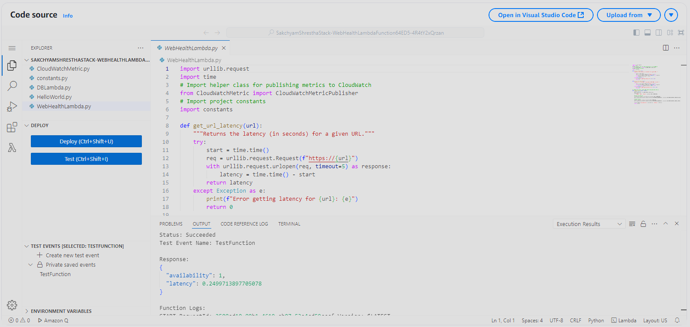
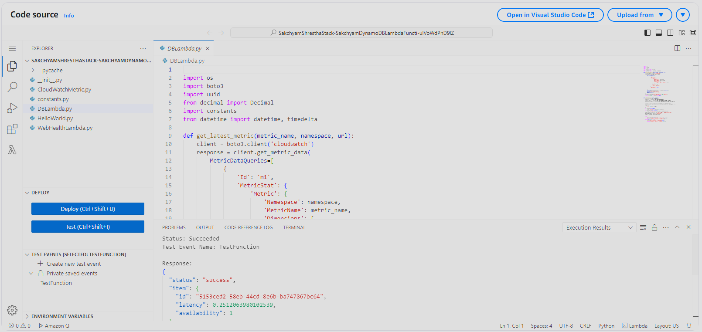
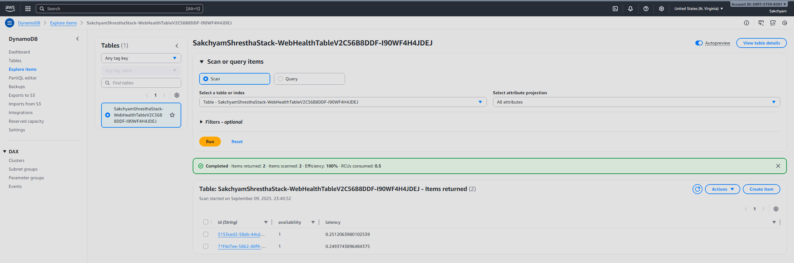
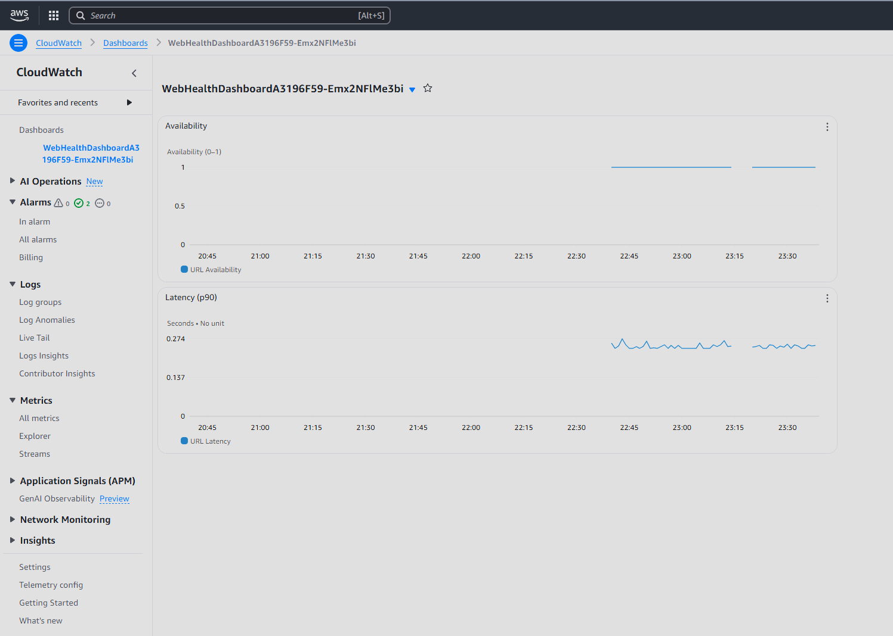
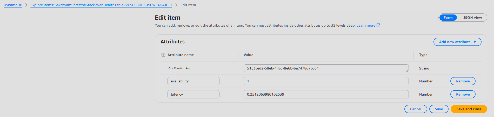
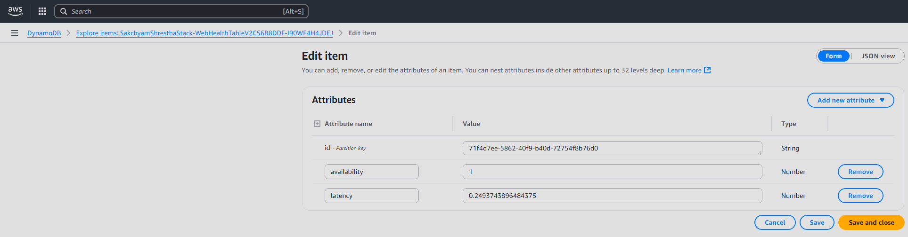
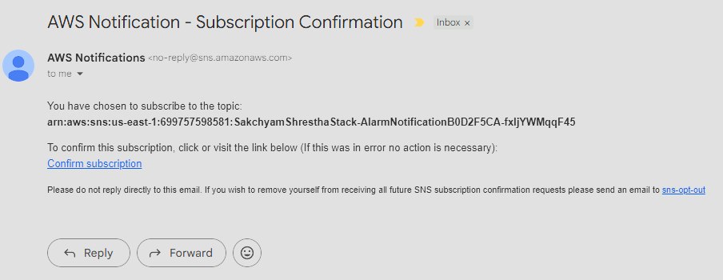

# Sakchyam Web Health Monitoring Stack

Advance Project - NIT6150  
WebHealth - CloudWatch Project

This project uses AWS CDK (Python) to deploy a serverless web health monitoring solution. It provisions a Lambda function that checks the availability and latency of a specified URL, publishes custom metrics to CloudWatch, sets up alarms for monitoring, and logs alarm notifications to DynamoDB via a dedicated Lambda.

---

## Features

- **Lambda Function:** Periodically checks the health of a target URL.
- **CloudWatch Metrics:** Publishes custom metrics for availability and latency.
- **CloudWatch Alarms:** Notifies when availability drops or latency exceeds thresholds.
- **EventBridge Rule:** Schedules Lambda execution every minute.
- **SNS Integration:** Sends alarm notifications to email and triggers a Lambda.
- **DynamoDB Logging:** Stores alarm notifications in a DynamoDB table via Lambda.
- **CloudWatch Dashboard:** Visualizes metrics and alarm thresholds.

---

## Prerequisites

- Python 3.8+
- AWS CLI configured
- AWS CDK installed (`npm install -g aws-cdk`)
- [boto3](https://pypi.org/project/boto3/) Python package

---

## Setup

1. **Clone the repository:**
    ```sh
    git clone <your-repo-url>
    cd SakchyamShrestha
    ```

2. **Create and activate a virtual environment:**
    ```sh
    python -m venv .venv
    .\.venv\Scripts\Activate
    ```

3. **Install dependencies:**
    ```sh
    pip install -r requirements.txt
    ```

4. **Bootstrap your AWS environment (if not already done):**
    ```sh
    cdk bootstrap
    ```

5. **Deploy the stack:**
    ```sh
    cdk deploy
    ```

---

## Configuration

Edit `modules/constants.py` to set the URL you want to monitor:
```python
URL_TO_MONITOR = "www.bbc.com/"
```

---

## DynamoDB Integration

- Alarm notifications are sent to an SNS topic.
- The SNS topic triggers a Lambda (`DBLambda`) that writes alarm details to a DynamoDB table (`WebHealthTableV2`).
- The Lambda expects SNS event structure. When testing manually, use:
    ```json
    {
      "Records": [
        {
          "Sns": {
            "Message": "{\"AlarmName\": \"TestAlarm\", \"NewStateValue\": \"ALARM\", \"NewStateReason\": \"Threshold Crossed\", \"StateChangeTime\": \"2025-09-05T12:00:00Z\"}"
          }
        }
      ]
    }
    ```

---

## CloudWatch Dashboard

- A dashboard named `URLMonitorDashboard` is created.
- It displays graphs for availability and latency, with alarm thresholds visually indicated.

---

## Troubleshooting

### Lambda DNS/Internet Issues

If you see errors like:
```
<urlopen error [Errno -2] Name or service not known>
```
- **Check if your Lambda is in a VPC.** If so, ensure it has outbound internet access via a NAT Gateway.
- **Remove the Lambda from the VPC** if it does not need access to private resources.

### DynamoDB Lambda Testing

If you get:
```
{"status": "error", "reason": "No Records key in event"}
```
- Use the SNS event structure above for testing.

---

*For questions or issues, please open an issue on GitHub.*


### ScreenShots:

### 1. Web Health Checks


### 2. DynamoDB Check



### 3. Web Health Dashboard


### 4. DynamoDB Logging of metrics for audit/history



### 5. Alarms & Notifications via SNS (email and SMS subscription)

